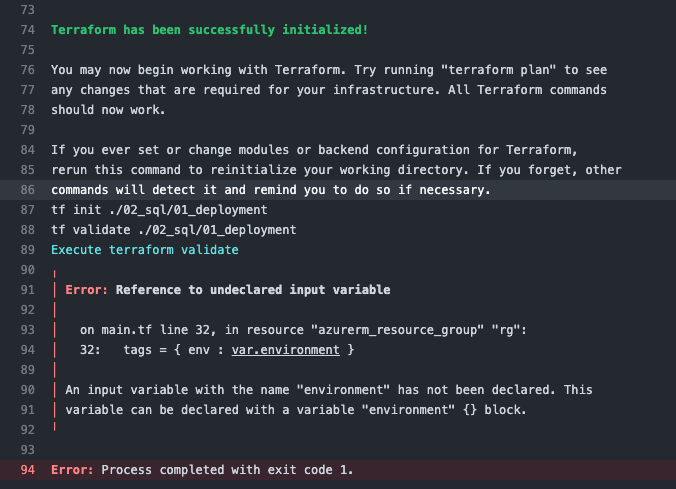

## Validate Error

Validate Error shows correctly 

Environment: Github Actions

## Setup

Updated [main.tf](../IAC/Terraform/terraform/02_sql/01_deployment/main.tf) to generate error, on line 32

```terraform
      tags = { env : var.environment }
```

## Output
