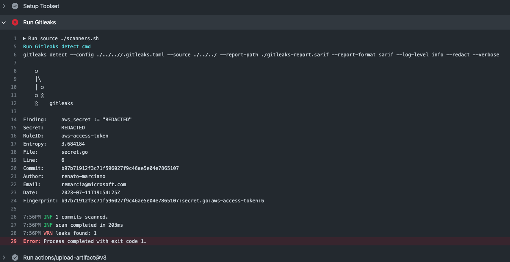

# Git Leaks Error

Environment: Github Actions

## Setup

Added golang [file](../secret.go) to trigger git leaks

```golang
    package main

    

    import "fmt"

    

    func main() {
        aws_secret := ""
        fmt.Println("Hello, World!")
        fmt.Println("AWS Secret:", aws_secret)
    }
```

## Result

Github Action Run [here](https://github.com/renato-marciano/symphony-github-terraform/actions/runs/5524300345/jobs/10076414774)

