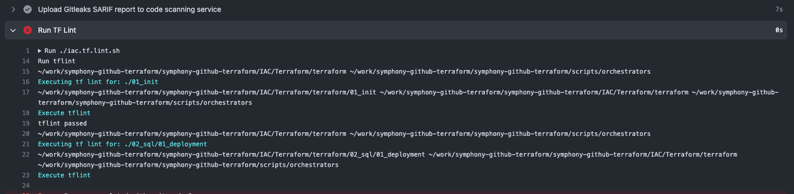

# TF Lint Error

Relted PR: https://github.com/microsoft/symphony/pull/207

Environment: Github Actions

## Setup:
Updated [main.tf](../IAC/Terraform/terraform/02_sql/01_deployment/main.tf) with below to produce lint error:

```terraform
    resource "aws_instance" "main" {
    instance_type = "t2.micro"
    }
```

## Before Fix

Github Actions Run [here](https://github.com/renato-marciano/symphony-github-terraform/actions/runs/5523677291/jobs/10074923362)




## Fix
Updated lint function in [iac.tf.sh](../scripts/orchestrators/iac.tf.sh), line 123

```bash
    lint() {
        _information "Execute tflint"

        lint_res_file_name="$(basename $PWD)_lint_res.xml"
        filePath=$(echo "${lint_res_file_name}" | sed -e 's/\//-/g')

        # We will disable "exit on error" to avoid tflint breaking our execution
        set +e
        tflint >"$filePath" 2>&1; local code=$?
        set -e

        if [[ -z $(grep '[^[:space:]]' $filePath) ]]; then
            echo "tflint passed"
            #exit 0
        else
            echo "tflint failed. lint results in file name ${lint_res_file_name}"
            sed -i 's/\x1b\[[0-9;]*m//g' $filePath
            _error $(<"$filePath")
            #exit 1
        fi

        return $code
    }
```

## After Fix

Github Actions Run [here](https://github.com/renato-marciano/symphony-github-terraform/actions/runs/5523844903/jobs/10075330261)


